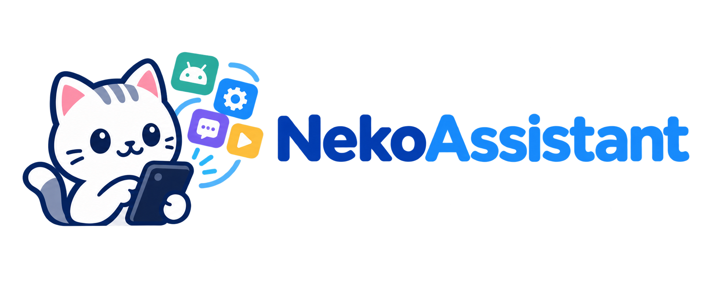

# Neko Assistant

Neko Assistant is an open-source replica of [Doubao Phone Assistant](https://o.doubao.com/).

It uses an LLM agent to operate phone apps in the background. Shizuku provides the elevated access required to create virtual displays, inspect the screen, and inject input events.

## Requirements

- Android 12 or newer
- [Shizuku](https://shizuku.rikka.app/) installed, running, and authorized through ADB or root
- An OpenAI-compatible LLM provider and model configured in the app
